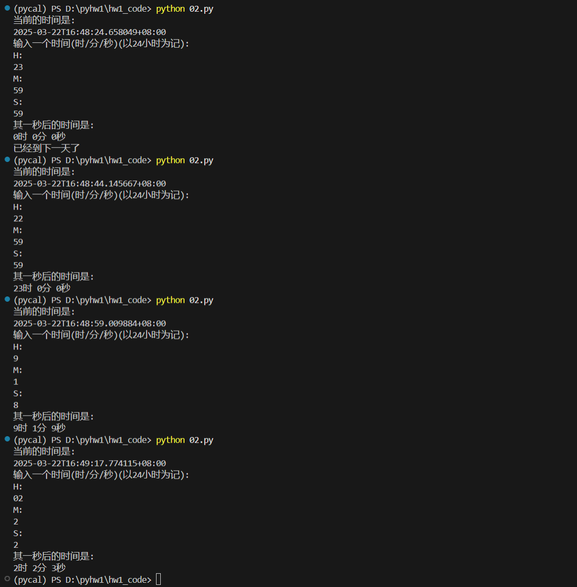
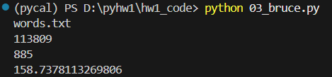
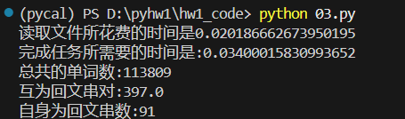
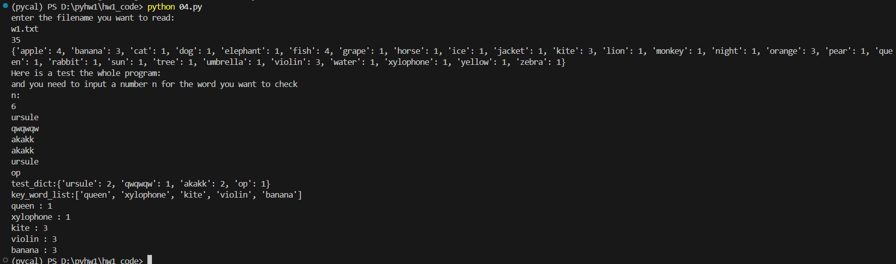

# 实验一 PYTHON基础与数据结构

## 一、目的和要求
1. 熟悉Python的开发调试环境；
2. 熟悉Python外部库的调用；
3. 掌握Python语言基本语法；
4. 熟悉Python的数据结构。

## 二、实验环境
1. python == 3.9.21
2. 实验平台 vscode

## 三、实验内容
1．Python 代码理解polygon.py： （1）运行和阅读代码； （2）理解代码功能；
（3）修改代码，练习调用文件中其他几个图形函数。
2．输入输出：编写脚本文件，设计友好的用户输入输出提示，用户输入一
个时间（24 小时制，包含时、分、秒），输出1 秒后的时间。
3．反序对：如果一个单词是另一个单词的反向序列，则称这两个单词为“反
向对”。编写代码输出word.txt 中词汇表包含的反向对。
4．文本分析算法设计：
（1）设计Python 程序读入一个英文单词组成的文本文件，统计该文本文件
中各个单词出现的次数。设计测试用例验证代码的正确性。
（2）设计Python 程序读入一个英文单词组成的文本文件，统计其中包含的
某给定关键词列表中各个单词出现的频率。设计测试用例验证代码的正确性。
## 四、实验设计思路与实验方法
### 题目1: 
实验了不同的绘制函数
### 题目2:
**设计思路:**  首先我采用了24小时计数,那么在每一个数字(分和秒)达到60的时候要归零并且下一位要加一,时打到23的时候变为24的时候会归零
**具体设计方法:**  我采用了从秒开始依次往前遍历看是否符合进位的要求 (可以直接对其进行%60 != 1进行检验) 我用了更加简单的临界条件判断的方法

### 题目3:
**设计思路**  1. 首先我为了保证可移植性,用了os库来获取绝对路径来读取word.txt文件(然后再输入word.txt文件与脚本的相对路径)  2. 其次由于要求反序对的数量,而且在word的文件中总共有113809个单词,所以如果用O(n^2)的暴力算法虽然可行但是时间上会非常慢,所以我想到了之前c++STL库中经常用的set结构,然后查阅python的相关资料证实了该想法的可能性  
**具体设计方法**  1. 首先我从文件中读取所有的单词到一个list之中,我首先实验了如果真的用暴力算法的话所花费的时间是多久,结果和之前的预期一致,这个方法不可行. 接着就将list转换为set这样更方便查找,接着遍历整个set. 并且我记录了两个关键操作所花费的时间(分别是读取文件以及完成后续运算)  2. 我对所有的反序对进行分组,分为了自己是回文字符串或者有另外的字符串与其正好相反 分别进行统计之后我发现了其实总共的回文串并不多,所以我在03_1.py文件中把这两个不同的回文串类比的都分别用txt文件保存在了相同的目录下.同时03_bruce.py是测试暴力算法的时间.
## 题目4:
**设计思路**  1. 首先我让AI给我生成了一个文件w1.txt其中有40个单词我要求其中间有重复的单词然后我还是利用上一题的思路但是把set换成了dict并且直接输入dict就可以得到答案 2. 并且我设置了可交互的测试系统,用户手动输入自己想要验证的单词列表
 3. 关键词列表我是随机选取的用randint函数选取的
## 五、测试用例
### 题目2:

### 题目3:
 **部分测试结果**    暴力测试结果

<set方法测试结果>

#### 两者进行对比可以很明显的发现其速度的差异是非常大的
### 题目4:
